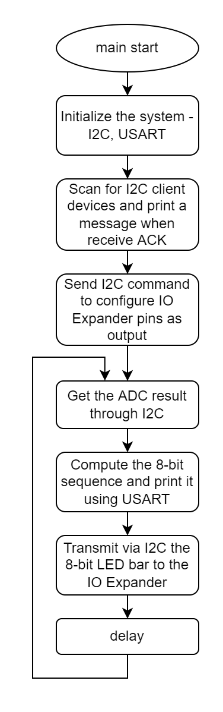
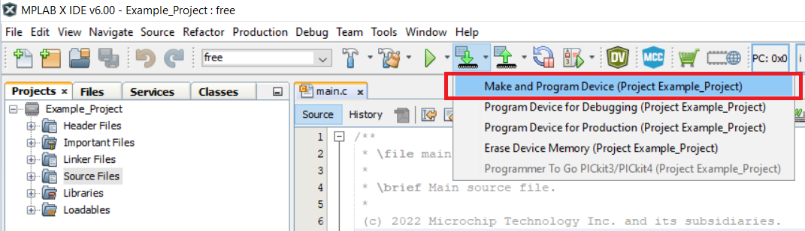

<!-- Please do not change this html logo with link -->

#  Getting Started with Inter-Integrated Circuit (I2C) Using the AVR64DD32 Microcontroller with MCC Melody

This example shows the basic functionality of the Two-Wire Interface (TWI) peripheral with a basic I2C communication, both reading and writing from or to the Client devices using MCC Melody. The device is connected to the PICkit™ Serial I2C Demo Board to communicate with the MCP3221 and MCP23008 I2C Client devices. The AVR64DD32 first scans the I2C bus to discover all devices available on the bus. A message is transmitted through the Universal Synchronous and Asynchronous Receiver and Transmitter (USART) to indicate the addresses of the devices that respond with the Acknowledge (ACK) signal. A voltage is read by the MCP3221 (equipped with a 12-bit Analog-to-Digital Converter (ADC)) and the result is transmitted through I2C to the AVR64DD32 device. Then, the MCU transmits an 8-bit sequence to the MCP23008, equipped with an I/O Expander, to drive 8 LEDs on an LED bar. The LED display (consisting of 8 LEDs) indicates the potentiometer voltage value (divided in subranges).
  

## Related Documentation

More details and code examples on the AVR64DD32 can be found at the following links:

- [AVR64DD32 Product Page](https://www.microchip.com/wwwproducts/en/AVR64DD32)
- [AVR64DD32 Code Examples on GitHub](https://github.com/microchip-pic-avr-examples?q=AVR64DD32)
- [AVR64DD32 Project Examples in START](https://start.atmel.com/#examples/AVR64DD32CuriosityNano)

## Software Used

- [MPLAB® X IDE](http://www.microchip.com/mplab/mplab-x-ide) v6.00 or newer
- [MPLAB® X IPE](https://www.microchip.com/en-us/tools-resources/production/mplab-integrated-programming-environment) v6.00 or newer
- [MPLAB® XC8](http://www.microchip.com/mplab/compilers) v2.36 or newer
- [AVR-Dx Series Device Pack](https://packs.download.microchip.com/) v2.1.152 or newer

## Hardware Used

- The AVR64DD32 Curiosity Nano Development board is used as a test platform
   
- PICkit Serial I2C Demo Board [(PKSERIAL-I2C1)](https://www.microchip.com/DevelopmentTools/ProductDetails/PKSERIAL-I2C1)
  - MCP3221
  - MCP23008

## Operation

To program the Curiosity Nano board with this MPLAB® X project, follow the steps provided in the [How to Program the Curiosity Nano Board](#how-to-program-the-curiosity-nano-board) chapter.  

## Setup

The AVR64DD32 Curiosity Nano Development board is used as the test platform. The 12-bit ADC is used to transmit an analog value.

 The following configurations must be made:

|    Pin    |   Configuration    |
| :-------: |   :-----------:    |
| PA2 (SDA) |    Digital I/O     |
| PA3 (SCL) |    Digital I/O     |
| PD4 (TX)  |    Digital output  |

- The AVR64DD32 Microcontroller is connected to the PICkit Serial I2C Demo Board as in the figure below:
 

## Demo

- The software diagram of this application is presented in the figure below:
 

- After initializing the I2C and USART, the microcontroller will scan the bus to discover the Client devices available. After detecting the devices, a read command and a write command will be performed using those devices. The flow of the application is presented in the figure below:
  

- Visualize the serial output on the terminal window. In this example, the I2C device scanning phase is described. The Client devices connected respond with Acknowledge (ACK).
 

- After turning the potentiometer rotor one way and the other, the LEDs will indicate the level of that voltage, as shown below. 
 

- The ADC conversion result is received from the 12-bit ADC I2C Client device, it is normalized (obtaining a 3-bit value to be indicated using the 8-LED bar), and the result is transmitted to the 8-bit I/O Expander I2C Client device.
 

## Summary 

This application shows how to use the TWI0 as an I2C compatible Host to communicate with two I2C Client devices:

- MCP3221 – equipped with a 12-bit ADC
- MCP23008 – equipped with an I/O Expander
 

[Back to top](#getting-started-with-inter-integrated-circuit-i2c-using-the-avr64dd32-microcontroller-with-mcc-melody) 

##  How to Program the Curiosity Nano Board

This chapter demonstrates how to use the MPLAB® X IDE to program an AVR® device with an Example_Project.X. This can be applied for any other project.

1.  Connect the board to the PC.

2.  Open the Example_Project.X project in MPLAB® X IDE.

3.  Set the Example_Project.X project as main project.
     Right click the project in the **Projects** tab and click **Set as Main Project**.
     

4.  Clean and build the Example_Project.X project.
     Right click the **Example_Project.X** project and select **Clean and Build**.
     

5.  Select **AVRxxxxx Curiosity Nano** in the Connected Hardware Tool section of the project settings:
     Right click the project and click **Properties**.
     Click the arrow under the Connected Hardware Tool.
     Select **AVRxxxxx Curiosity Nano** (click the **SN**), click **Apply** and then **OK**:
     

6.  Program the project to the board.
     Right click the project and click **Make and Program Device**.
     

 

- [Back to top](#getting-started-with-inter-integrated-circuit-i2c-using-the-avr64dd32-microcontroller-with-mcc-melody)
